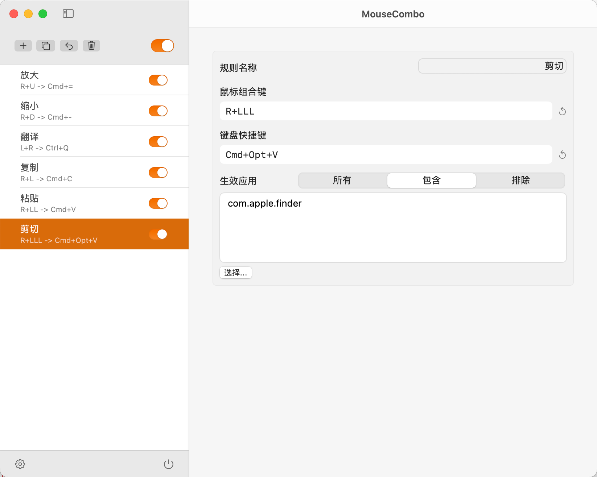
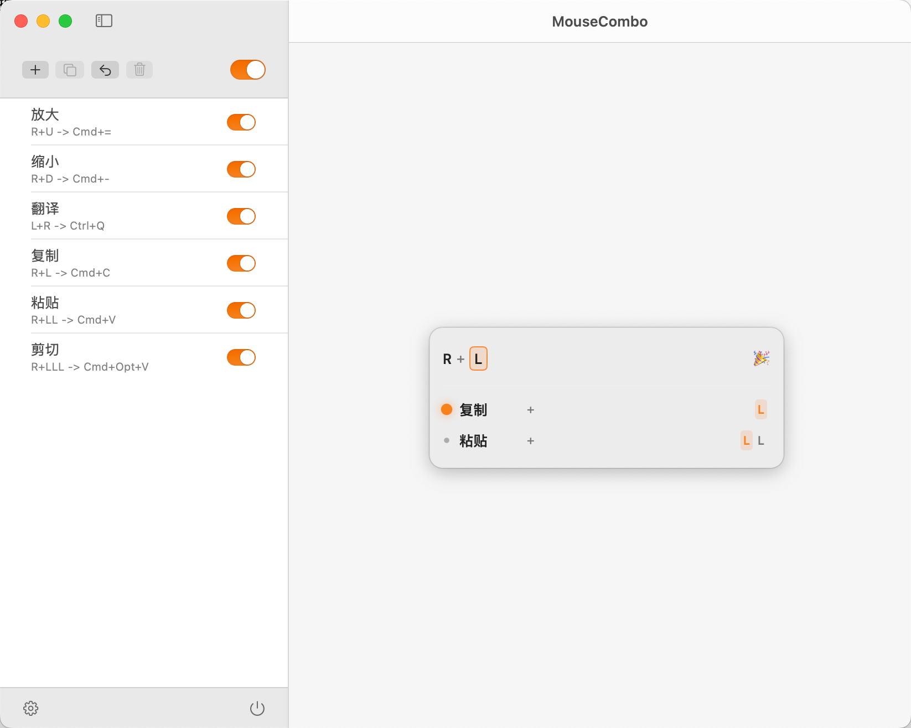
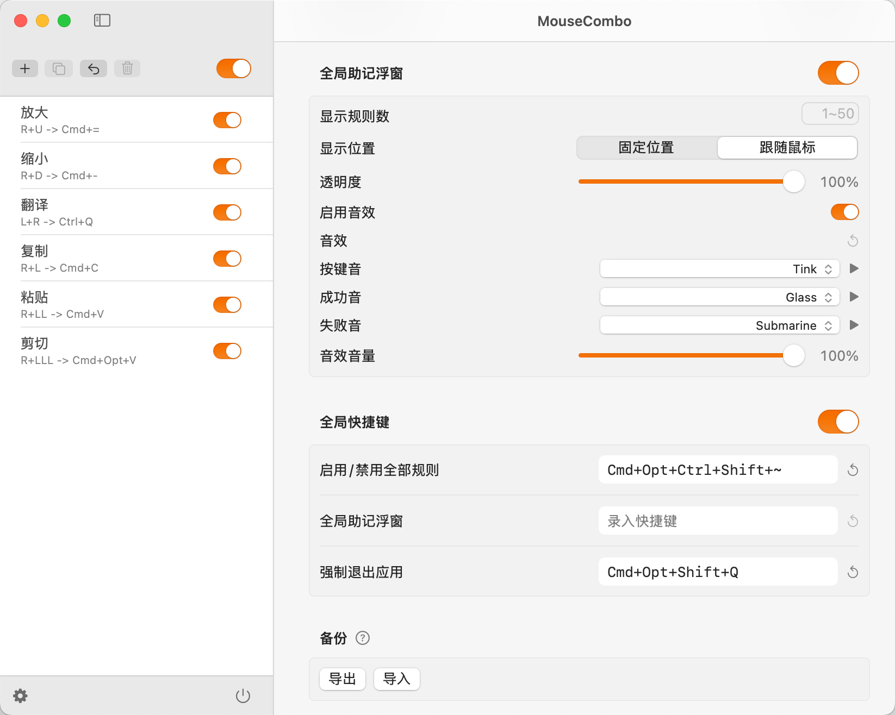

<p align="center">
  
</p>
<h1 align="center">MouseCombo</h1>
<p align="center">
  
  
</p>
<p align="center">
  <a href="https://github.com/WooHooDai/MouseCombo/releases/latest/download/MouseCombo.dmg">
    
  </a>
</p>

将**鼠标组合**映射为**键盘快捷键**，实现单手高效操作⚡️。

全局助记浮窗🧠和触发音效🎵，让使用体验像是游戏金手指/搓连招。

<details>
  <summary><i>点击查看30s视频演示（带音效）</i></summary>
  <video src="https://github.com/user-attachments/assets/2186fe50-916c-48a3-a786-62bda124e382" controls width="100%"></video>
</details>


## 核心特点

- 🧙 无限组合：支持无限长的鼠标组合序列，可将全部快捷键集于一手。
- 🧠 无需记忆：全局助记浮窗，照着点无需硬记
- ⛔️ 应用限定：支持`所有/包含/排除`三类限定模式，相同组合不同映射。
- 👀 可视配置：鼠标组合、键盘快捷键、应用限定、助记浮窗位置，全部可视化配置。
- 🎵 乐趣音效：支持精细自定义触发音效，在游戏版强化肌肉记忆。

## 场景示例


|          鼠标组合          |          映射为           | 应用限定 |            场景             |
| :------------------------: | :-----------------------: | :------: | :-------------------------: |
|  按住中键 + 连续滚轮↑/↓  |       cmd+- / cmd+=       |    无    |          连续缩放页面           |
| 按住右键 + 左键1次/2次/3次 | cmd+c / cmd+v / cmd+opt+v |  Finder  |     复制 / 移动（剪切）     |
|  按住右键 + 滚轮↑/↓  | cmd+shift+[ / cmd+shift+] |  Safari  | 上一个标签页 / 下一个标签页 |

## 下载&安装

1. 前往 [最新版本发布页](https://github.com/WooHooDai/MouseCombo/releases/latest) 下载 `MouseCombo.dmg`
2. 打开 `MouseCombo.dmg`
3. 将 `MouseCombo.app` 拖拽到 `Applications` 文件夹
4. 从“应用程序”中启动 `MouseCombo`

### 常见问题

<details>
  <summary><b>提示“无法验证开发者”或“无法检查恶意软件”</b></summary>
  <p>1. 点击弹窗的“取消”。</p>
  <p>2. 打开 `系统设置 (System Settings) -> 隐私与安全性 (Privacy & Security)`。</p>
  <p>3. 向下滑动找到`安全性`板块，看到`“XXX 已被阻止...”`提示，点击旁边的 `“仍要打开” (Open Anyway)`。</p>
  <p>4. 在二次确认弹窗中点击“打开”，之后即可正常使用。</p>
</details>

<details>
  <summary><b>提示“已损坏，无法打开”或“移到废纸篓”</b></summary>
  <p>1. 打开 `终端 (Terminal)`（在 Launchpad 中搜索“终端”）。</p>
  <p>2. 输入以下命令（末尾带空格，不要按回车）：
   ```bash
   sudo xattr -rd com.apple.quarantine 
   ```
  </p>
  <p>3. 将“应用程序”文件夹里的 `MouseCombo.app` 拖入终端窗口，路径会自动补全。</p>
  <p>4. 按下 回车键，输入 开机密码（输入时不显示字符），再次回车即可。</p>
</details>

## 应用截图
| 主界面 | 助记浮窗 | 设置界面 |
| :---: | :---: | :---: |
|  |  |  |

## 其他说明

- ⚠️ 重要提醒：在辅助功能列表里，如果在开启本应用授权情况下从列表中删除本应用，**‼️将导致键盘、鼠标卡死‼️**
  - 该问题由 macOS TCC 的限制导致，暂无法避免
  - 若要删除本应用授权，请务必 **‼️先关闭授权按钮‼️**，再从列表中删除
  - 若遇到卡死，一般在10-90秒间键盘可恢复使用，尝试反复按下键盘快捷键`cmd+opt+shift+Q`可强制退出本应用
- 本项目由[MouseCombo.spoon](https://github.com/WooHooDai/MouseCombo.spoon)脚本发展而来，如您使用HammerSpoon且不想额外下载本软件，可考虑使用该脚本
- 本软件很适合和 tourbox 等可将按钮映射为鼠标按键的外设搭配使用。

## 支持本项目

♥️ 如果您觉得这个项目对您有帮助，欢迎 _**💰赞赏**_，欢迎 _**🌟Star**_

🤔 有任何问题或建议，可发布 issue 或邮件沟通(<a class="Link--primary wb-break-all" href="mailto:woohoodai@gmail.com">woohoodai@gmail.com</a>)


<br />

---

<a href="https://www.buymeacoffee.com/woohoodai" target="_blank"></a>
